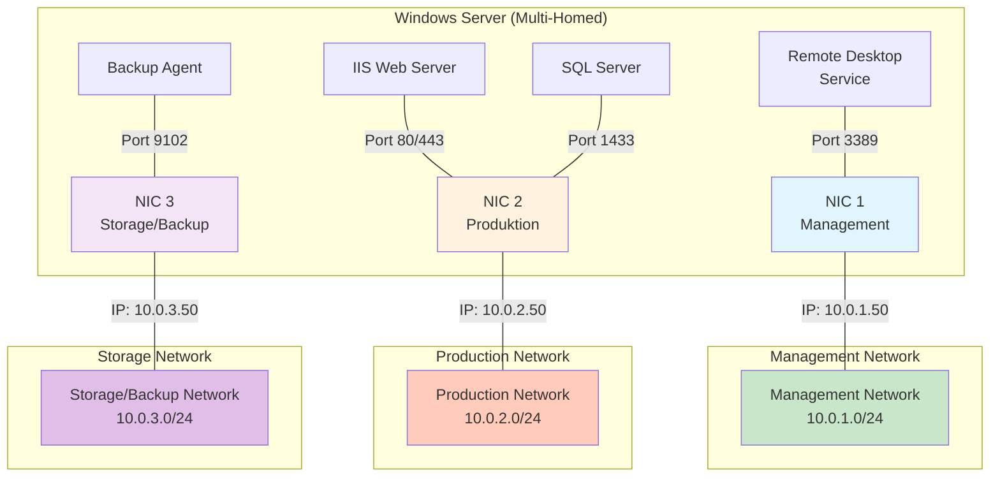

# Windows Server mit mehreren IP-Adressen

## 1. Einleitung

Ein Windows Server kann mehrere IP-Adressen auf unterschiedlichen Netzwerkschnittstellen (NICs - Network Interface Cards) konfiguriert haben. Diese Konfiguration, auch als **Multihoming** bekannt, bietet verschiedene Vorteile in modernen IT-Infrastrukturen:

- **Netzwerksegmentierung**: Trennung von Management-, Produktions- und Backup-Traffic
- **Redundanz**: Failover und Ausfallsicherheit durch mehrere Netzwerkpfade
- **Dienste-Isolation**: Unterschiedliche Windows-Dienste können an spezifische IPs gebunden werden
- **Performance-Optimierung**: Optimale Ressourcennutzung durch dedizierte Verbindungen für verschiedene Workloads
- **Sicherheit**: Beschränkung von Zugriff auf spezifische Netzwerke durch IP-Bindung

Diese Dokumentation behandelt die Planung, Einrichtung und Best Practices für Multi-IP-Konfigurationen auf Windows Servern.

---

## 2. Architektur-Diagramm



---

## 3. IP-Konfiguration

| Interface-Name | IP-Adresse | Subnetzmaske | Gateway | Funktion/Zweck | VLAN |
|---|---|---|---|---|---|
| Ethernet 1 | 10.0.1.50 | 255.255.255.0 | 10.0.1.1 | Management, RDP, Server-Administration | 10 |
| Ethernet 2 | 10.0.2.50 | 255.255.255.0 | 10.0.2.1 | Anwendungsdatenverkehr, IIS, SQL Server | 20 |
| Ethernet 3 | 10.0.3.50 | 255.255.255.0 | 10.0.3.1 | Backup, Storage-Traffic, Cluster-Heartbeat | 30 |

**Erläuterungen:**

- **Ethernet 1 (Management)**: Dedizierte Verbindung für Administrative Aufgaben, Remote Desktop und Server-Management
- **Ethernet 2 (Produktion)**: Hauptverbindung für Produktionsanwendungen und Kundendatenverkehr
- **Ethernet 3 (Storage)**: Isolierte Verbindung für Backup-, Storage- und Cluster-Kommunikation zur Vermeidung von Bandbreitenkonflikten

---

## 4. Dienste je IP/Interface

| Windows-Dienst / Anwendung | Gebundene IP-Adresse | Interface | Port(e) | Beschreibung |
|---|---|---|---|---|
| Remote Desktop (RDP) | 10.0.1.50 | Ethernet 1 | 3389 | Administrative Fernwartung über Management-Netz |
| Internet Information Services (IIS) | 10.0.2.50 | Ethernet 2 | 80, 443 | Webserver für Produktionsanwendungen |
| SQL Server (Database Engine) | 10.0.2.50 | Ethernet 2 | 1433 | Datenbankserver für Anwendungsdaten |
| SQL Server (Reporting Services) | 10.0.2.50 | Ethernet 2 | 80 | Business Intelligence und Reporting |
| Backup Executive / Veritas Backup | 10.0.3.50 | Ethernet 3 | 9102 | Backup-Client für Datensicherung |
| Cluster Service (falls Cluster) | 10.0.3.50 | Ethernet 3 | 3343 | Cluster-Kommunikation und Heartbeat |
| DNS Server | 10.0.1.50 | Ethernet 1 | 53 | Interne Namensauflösung im Management-Netz |
| Windows Update | 10.0.1.50 | Ethernet 1 | 80, 443 | Patch-Management über Management-Netz |

---

## 5. Einrichtungsschritte

### Schritt 1: NIC-Identifikation
Zunächst müssen die verfügbaren Netzwerkschnittstellen identifiziert werden:

```powershell
# Alle Netzwerkadapter anzeigen
Get-NetAdapter

# Detaillierte Informationen
Get-NetIPConfiguration
```

### Schritt 2: IP-Adresse für sekundäre NIC konfigurieren (PowerShell)

```powershell
# Beispiel: IP-Adresse zur sekundären NIC (Ethernet 2) hinzufügen
New-NetIPAddress -InterfaceAlias "Ethernet 2" `
    -IPAddress "10.0.2.50" `
    -PrefixLength 24 `
    -DefaultGateway "10.0.2.1"
```

**Parameter-Erklärung:**
- `-InterfaceAlias`: Name der Netzwerkschnittstelle (z.B. "Ethernet 2")
- `-IPAddress`: Die zuzuweisende IP-Adresse
- `-PrefixLength`: Subnetzmaske in CIDR-Notation (24 = 255.255.255.0)
- `-DefaultGateway`: Gateway für dieses Interface

### Schritt 3: Zusätzliche sekundäre IP-Adressen auf derselben NIC

Falls mehrere IPs auf einer NIC konfiguriert werden sollen:

```powershell
# Zweite IP auf demselben Interface hinzufügen
New-NetIPAddress -InterfaceAlias "Ethernet 2" `
    -IPAddress "10.0.2.51" `
    -PrefixLength 24
```

### Schritt 4: DNS-Server konfigurieren

```powershell
# DNS-Server für Interface setzen
Set-DnsClientServerAddress -InterfaceAlias "Ethernet 2" `
    -ServerAddresses ("10.0.2.1", "8.8.8.8")
```

### Schritt 5: Konfiguration via Server Manager (GUI)

1. **Server Manager** öffnen
2. **Local Server** → **Ethernet [X]** (unter Netzwerkverbindungen)
3. Rechtsklick → **Properties**
4. **IPv4-Properties** öffnen
5. **Advanced...** wählen
6. Neue IP-Adresse unter **IP Addresses** hinzufügen
7. Mit **OK** bestätigen

### Schritt 6: Konfiguration überprüfen

```powershell
# Alle konfigurierten IP-Adressen anzeigen
Get-NetIPAddress -AddressFamily IPv4

# IP-Routing-Tabelle prüfen
route print
```

---

## 6. Best Practices & Hinweise

### Routing und Default Gateway

⚠️ **Wichtig**: Nur auf **einem Interface** sollte ein Default Gateway konfiguriert sein. Mehrere Default Gateways können zu unerwarteten Routing-Problemen führen:

```powershell
# Nur Gateway auf primärer NIC (Ethernet 1)
New-NetIPAddress -InterfaceAlias "Ethernet 1" `
    -IPAddress "10.0.1.50" `
    -PrefixLength 24 `
    -DefaultGateway "10.0.1.1"

# Auf Ethernet 2 KEIN Default Gateway, sondern nur IP
New-NetIPAddress -InterfaceAlias "Ethernet 2" `
    -IPAddress "10.0.2.50" `
    -PrefixLength 24
```

Falls Zugriff auf Fremdnetze von Ethernet 2 nötig ist, statische Routen verwenden:

```powershell
# Statische Route für spezifisches Netz
New-NetRoute -DestinationPrefix "192.168.1.0/24" `
    -NextHop "10.0.2.1" `
    -InterfaceAlias "Ethernet 2"
```

### Windows Firewall konfigurieren

Firewall-Regeln sollten nach Interface/IP spezifiziert werden:

```powershell
# Firewall-Regel für spezifisches Interface erstellen
New-NetFirewallRule -DisplayName "IIS Port 80 (Produktion)" `
    -Direction Inbound `
    -Action Allow `
    -Protocol TCP `
    -LocalPort 80 `
    -LocalAddress "10.0.2.50"

# RDP nur aus Management-Netz erlauben
New-NetFirewallRule -DisplayName "RDP Management Only" `
    -Direction Inbound `
    -Action Allow `
    -Protocol TCP `
    -LocalPort 3389 `
    -LocalAddress "10.0.1.50" `
    -RemoteAddress "10.0.1.0/24"
```

### Dienste an spezifische IPs binden

**IIS (Internet Information Services):**
1. IIS Manager öffnen
2. Website → **Bindings**
3. Bei jedem Binding die gewünschte IP-Adresse wählen (anstatt "All Unassigned")

**SQL Server:**
1. SQL Server Configuration Manager öffnen
2. **SQL Server Network Configuration** → **Protocols for [INSTANCE]** → **TCP/IP**
3. Im Tab **IP Addresses** für jede IP das Häkchen setzen und Port spezifizieren

### Monitoring und Fehlerbehebung

```powershell
# IP-Konfiguration testen
Test-NetConnection -ComputerName 10.0.2.50 -Port 1433

# Verbindungen pro Interface anzeigen
Get-NetTCPConnection | Where-Object {$_.LocalAddress -like "10.0.*"}

# Netzwerk-Statistiken
netstat -ano
```

### Häufige Fehler und Lösungen

| Problem | Ursache | Lösung |
|---|---|---|
| Host kann sekundäre IP nicht erreichen | Firewall blockiert | Firewall-Regel für Interface/IP hinzufügen; Netzwerk-ACLs prüfen |
| Standardgateway-Konflikt | Mehrere Default Gateways konfiguriert | Nur auf primärem Interface konfigurieren; statische Routen verwenden |
| Dienst nicht auf sekundärer IP erreichbar | Dienst auf "All Interfaces" gebunden | Dienst-Binding auf spezifische IP ändern |
| Asymmetrisches Routing | Antworten gehen über falsches Interface | Kernel TCP/IP-Stack verbietet das, sollte automatisch korrekt sein |
| Langsame Verbindung zu sekundärer IP | Suboptimales Routing oder falsche Gateway | Routing-Tabelle prüfen; MTU-Größe überprüfen |

### NIC-Teaming und Redundanz

Für Hochverfügbarkeit können mehrere physische NICs zu einem Team verbunden werden:

```powershell
# Neue Team erstellen
New-NetLbfoTeam -Name "Team1" `
    -TeamMembers "Ethernet 1", "Ethernet 2" `
    -TeamingMode SwitchIndependent `
    -LoadBalancingAlgorithm Dynamic
```

### VLAN-Tagging

Falls VLANs verwendet werden, können diese auf der VM/dem Server konfiguriert werden:

```powershell
# VLAN auf Interface setzen
Set-NetAdapterAdvancedProperty -Name "Ethernet 1" `
    -RegistryKeyword "VlanID" `
    -RegistryValue "10"
```

---

## Zusammenfassung

Eine Multi-IP-Konfiguration auf Windows Servern ermöglicht:
- ✅ Bessere Netzwerk-Performance durch Bandbreitentrennung
- ✅ Erhöhte Sicherheit durch Segmentierung
- ✅ Flexibilität beim Dienste-Management
- ✅ Ausfallsicherheit durch redundante Verbindungen

Durch sorgfältige Planung und Beachtung dieser Best Practices lässt sich eine robuste und wartbare Multi-IP-Infrastruktur aufbauen.

---

**Zuletzt aktualisiert:** 2026-09-08  
**Gültig für:** Windows Server 2016, 2019, 2022
